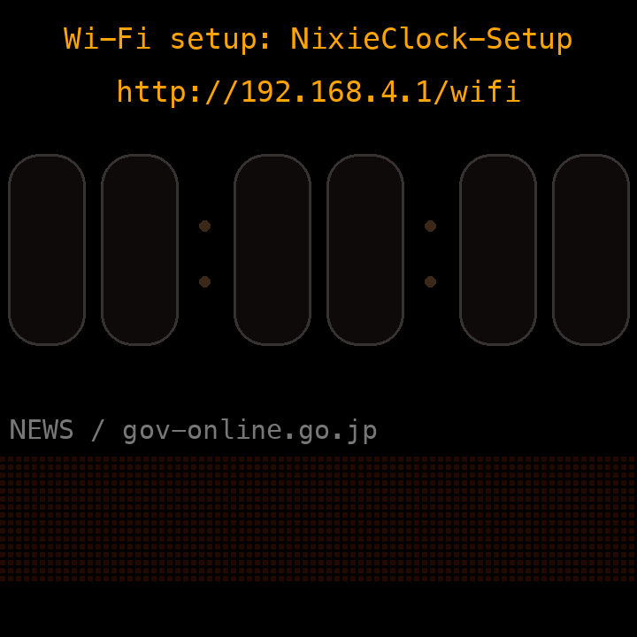
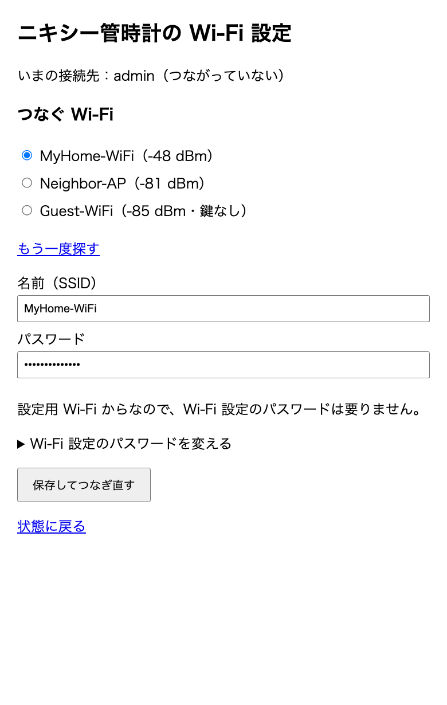
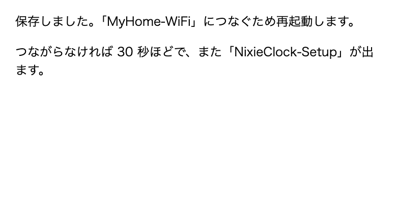
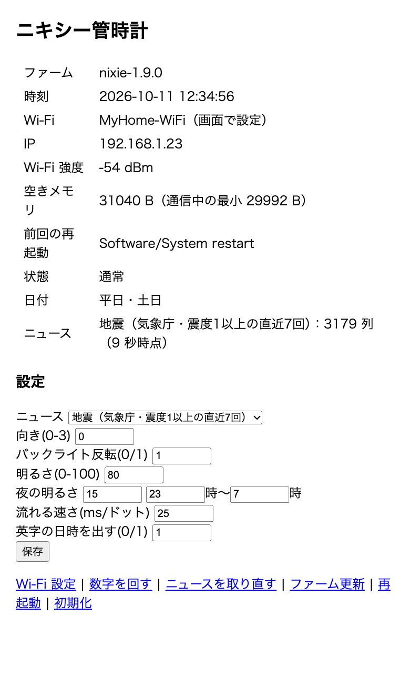
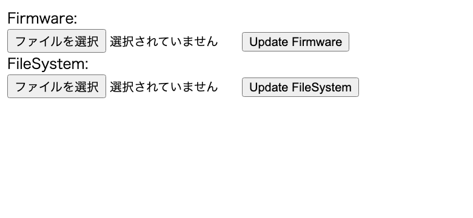

# NixieClock

Smart Weather Clock（SD Pro、[JUZIPi-tech/SD_PRO](https://github.com/JUZIPi-tech/SD_PRO)）用の自作ファームウェアです。
画面をニキシー管の時計と、ニュースが流れる電光掲示板に変えます。

## まずは最初の設定（Wi-Fi）

スマホ 1 台あれば、数分で終わります。パスワードの入力はほとんど要りません。
まだこのファームを時計に書き込んでいない場合は、先に下の「[書き込み方](#書き込み方)」を済ませてください。

### 1. 時計の電源を入れる

30 秒ほど待つと、時計が自分で Wi-Fi「**NixieClock-Setup**」を出し、画面に QR コードが出ます。



### 2. スマホのカメラで QR コードを読む

スマホのカメラを QR コードに向け、出てきた「NixieClock-Setup に接続」を押します。パスワードの入力は要りません。

- つなぐと、設定画面が自動で開きます。
- 開かないときは、ブラウザで **`http://192.168.4.1/wifi`** を開いてください。
- QR コードを読めないときは、スマホの「設定」→「Wi-Fi」で **NixieClock-Setup** を選び、パスワード **`password`** を入れてください。
- 「インターネットに接続されていません」と出ても、そのままつないでおいてください（時計の Wi-Fi はインターネットにつながっていないためです）。

### 3. 家の Wi-Fi を選んで保存する



1. 「つなぐ Wi-Fi」の一覧から、家の Wi-Fi を選びます。名前が下の「名前（SSID）」に入ります。
   一覧に無いときは、名前を直接入れてください（2.4GHz の Wi-Fi だけに対応しています。5GHz の Wi-Fi にはつながりません）。
2. 「パスワード」に、家の Wi-Fi のパスワードを入れます。
3. 「**保存してつなぎ直す**」を押します。



### 4. 時計がつながったことを確かめる

時計が再起動して家の Wi-Fi につなぐと、ニキシー管に時刻が出て、画面の一番上に時計の **IP アドレス**（例：`IP 192.168.1.23`）が出ます。
スマホも家の Wi-Fi に戻してください。

うまくつながらないときは、30 秒ほどでまた QR コードが出るので、2 からやり直してください。
家の Wi-Fi が一時的に切れて QR コードの画面になっても、スマホがつながっていなければ 3 分ごとに家の Wi-Fi を試し、つながれば自動で元に戻ります。

## 使い方（設定画面）

家の Wi-Fi につないだスマホやパソコンで、ブラウザから `http://<時計のIP>/` を開くと、状態と設定が出ます。



| 設定 | 内容 |
|------|------|
| ニュース | 地震（気象庁の情報から、震度 1 以上の直近 7 回。初期値）／政府広報オンライン（新着の説明文） |
| 向き | 0〜3（画面の回転） |
| バックライト反転 | 0／1（画面が暗いままなら切り替える。この機種は 1） |
| 明るさ・夜の明るさ | 0〜100 |
| 夜の時間帯 | 何時から何時まで暗くするか |
| 流れる速さ | 電光掲示板が 1 ドット進む間隔（ミリ秒。初期値 25） |
| 英字の日時を出す | 1＝出す（初期値）／0＝消す。ニキシー管の下の小さな日時 |

「保存」を押すとすぐに変わります。
ほかに「Wi-Fi 設定」「数字を回す」「ニュースを取り直す」「ファーム更新」「再起動」「初期化」があります。
「初期化」は、設定と保存した Wi-Fi をすべて消して、最初の状態（QR コードの画面）に戻します。人に譲るときなどに使ってください。

## できること

- **ニキシー管 8 本で `時:分:秒`**。毎分 0 秒に全部の数字がランダムに回り、左から順に止まります（ダイバージェンスメーター風）
- **ニキシー管の下に英字の日時**：`Sunday 11 October 2026 13:20:05` のように小さく表示（時計の中の時刻から作るので、通信できなくても出ます。設定で消せます）
- **上段に時計の IP アドレス**、その下に**日付**：「10月5日(月)」、祝日は「11月23日(勤労感謝の日)」のように祝日名
- **下段に LED 電光掲示板**：最近の地震（気象庁、震度 1 以上の直近 7 回）か、政府広報オンラインの新着が右から左へ流れます（出典を表示します）
- 夜間（初期値 23 時〜7 時）は画面を暗くします
- Wi-Fi は、時計の画面の QR コードをスマホで読んで設定できます

ダウンロード：[Releases](../../releases) の `NixieClock-<版>.bin`

## 対応機種

| 項目 | 内容 |
|------|------|
| 製品 | Smart Weather Clock（SD Pro） |
| マイコン | ESP8266（フラッシュ 4MB） |
| 画面 | ST7789 240×240 |

ほかの機種には書き込まないでください。ピン配置が違うと画面が映りません。

## 書き込み方

**自己責任でお願いします。** 書き込みに失敗すると、分解して USB シリアルから書き直す必要があるかもしれません。

### 元のファームから（初回）

1. 時計の IP アドレスを調べます（ルーターの接続一覧など）。
2. パソコンから元のファームの更新機能に送ります。

   ```bash
   curl -F "update=@NixieClock-1.9.0.bin" http://<時計のIP>/update_ota
   ```

   元のファームが書き込める大きさは約 500KB までです。このファームは約 440KB です。
3. 10 秒ほどで再起動します。家の Wi-Fi はまだ知らないので、上の「[まずは最初の設定](#まずは最初の設定wi-fi)」に進みます。

### このファームから（2 回目以降）

1. ブラウザで `http://<時計のIP>/update` を開きます。時計の IP アドレスは、時計の画面の一番上に出ています。
2. 「Firmware」の欄で .bin ファイルを選び、「Update Firmware」を押します。1〜2 分で再起動します。



パソコンからなら、次の 1 行でも書き込めます。

```bash
curl -F "firmware=@NixieClock-1.9.0.bin" http://<時計のIP>/update
```

1.8.0 から 1.9.0 に書き換えたときは、設定も家の Wi-Fi もそのまま残ります（1.6.x 以前から書き換えたときは、明るさ・ニュースなどの設定が初期値に戻ります）。

## 通信について

- 時刻：NTP（`ntp.nict.jp`、`pool.ntp.org`）。日本時間で表示します。
- 日付の画像と電光掲示板の文字：`http://api.hasami.uk/clock/` から取ります（日付は毎日 0 時、電光掲示板は 10 分ごと）。
  サーバーが取りに行く間隔は、地震（気象庁）が 15 分ごと、政府広報オンラインが 1 時間ごとです。
  時計には日本語フォントが無いので、サーバーが文字を点の画像にして返します。
  ESP8266 はメモリが少なく HTTPS では余裕がないため、HTTP で取ります。送るのは日付と取得元の種類だけで、個人の情報は送りません。
- このサーバーは個人で動かしているもので、予告なく止まったり変わったりすることがあります。止まると日付は英字（`10/5 MON`）になり、電光掲示板は流れません。

## 安全について

- 時計の設定画面・ファーム更新・再起動には、**パスワードがありません**。時計と同じ Wi-Fi（LAN）にいる人なら、誰でも設定を変えたり、ファームを書き換えたりできます。
  インターネットからは届きませんが、来客用など**他の人と共有する Wi-Fi には置かない**でください。
- 設定用 Wi-Fi「NixieClock-Setup」のパスワードは `password` で固定です。時計がこの Wi-Fi を出している間（家の Wi-Fi につながらないとき）は、近くにいる人も接続先を変えられます。
  そのかわり、人から譲り受けた時計でも、前の持ち主に聞かずに設定し直せます。

## うまく動かないとき

- **画面が真っ暗**：設定の「バックライト反転」を切り替えてください。
- **起動直後に 3 回続けて再起動した**：「安全モード」になり、画面を使わず Wi-Fi とファーム更新だけ動きます。`/update` から書き直してください。
- **元のファームに戻したい**：[JUZIPi-tech/SD_PRO](https://github.com/JUZIPi-tech/SD_PRO) の .bin を `/update` から書き込みます。
  元のファームのライセンス（リマインダー機能など）は、販売元での再発行が必要になるかもしれません。

## 注意

- このファームは製品の販売元とは関係ありません。改造は保証の対象外になることがあります。
- 書き込みや使用で起きた故障・損害について、作者は責任を負いません。

## ライセンス

[MIT License](LICENSE)
